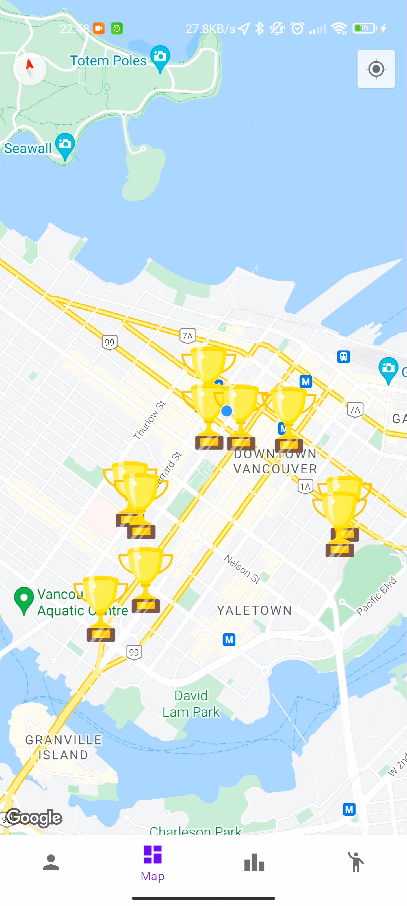

# World Exploration Action

## Project Description

Whether a long-time resident, or a tourist, it can often be difficult to find interesting locations to visit or find hotspots of activity since most websites spit out the same top-ten list of famous or historical buildings. Our project challenges mobile users, especially tourists and travel enthusiasts, to visit a curated list of nearby points of interest where they receive trophies upon visiting each location.

These trophies are ranked based on popularity and user ratings. When nearby, the user can collect the trophy and take a picture, to act as a memento. The user can also view photos taken by other users of that location. People can zoom in the pictures taken by other users, by tapping on the picture. Users can like it by tapping the red heart, and unlike it by tapping on it again. Nine pictures appear under each trophy, and are chosen randomly by default. The user can tap on the "Sort" button to display the nine newest uploaded pictures, and tap again to display the highest liked pictures.
A friend system allows users to add friends based on the user's id or email. When a friend request is received, the user receives a notification. A friend's leaderboard is included in the leaderboard page. It displays User's Friends and trophy counts sequentially. The user can also delete an existing friend.

Collected trophies are tallied up in a leaderboard displaying top 10 users with the highest score, encouraging friendly competition. A friend leaderboard shows the ranking including the user and the user's friends. The leaderboard is updated constantly updated. A private notification will also be sent if the user drops out from the leaderboard. A notification will be sent when the top position is swapped.

## Supporting Documents
[Project Report](resources/project_report.pdf)

[Project Presentation](resources/presentation_slides.pdf)
